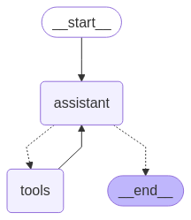

# AI-Agent-ChefNet
LangGraph, LangChain, LlamaIndex, LangFuse

ChefNet is a helpful cooking assistant. It can extract text from input images with recipes and provide with recommendations and instructions by retriving information from a cookbook (basic BM25 retrieval). `llm = ChatOpenAI(model="gpt-4o")`.

